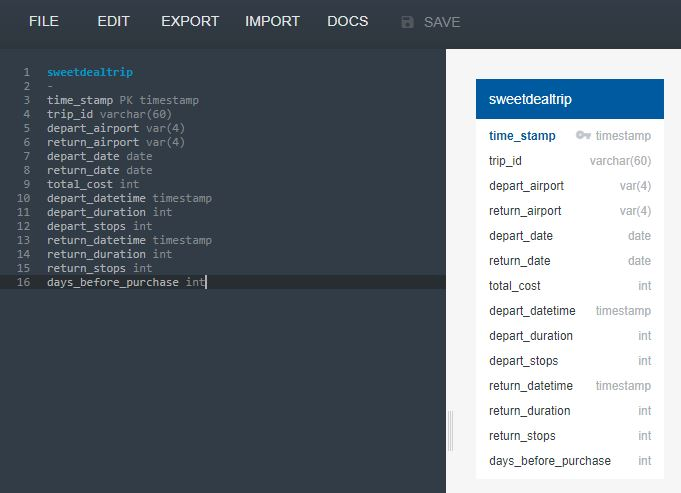
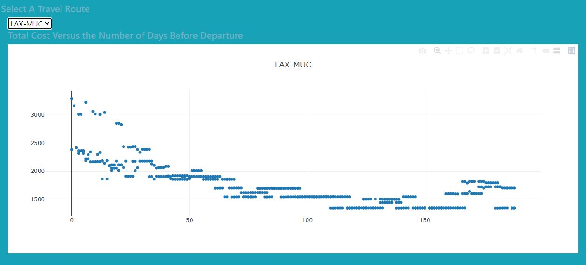

# SweetDeals

## Overview

This academic project seeks to utilize airline data to attempt to determine the best time to buy tickets for trips to a given destination.  Data are to be analyzed over the course of several days to determine trends and shifts in prices in an attempt to determine when an individual can find the best deals for booking a flight.

This project seeks to demonstrate a culmination of data science skills through the entire length of the data pipeline: data generation, data cleaning, data storage, data visualization, and communciation of findings/results from analysis.

The intended use for data collected is an academic exercise intended for the purpose of helping the user find the cheapest times to buy tickets, there is no intention for this tool to have commercial or for-profit use.

## Data Pipeline

### Data Generation and cleaning

Python, Selenium, and Beautiful Soup are utilized to interact with the website and generate datasets to be analyzed.  Data are pulled from the website on a daily basis in order to provide a dataset that may demonstrate when price fluctuations occur and when the best time to travel and/or the best time to purchase travel occur.

The sweet_deals.ipynb file is fully functional as a standalone tool for getting flight information, cleaning the data to be set to the correct datatypes, and feeding the data directly into the AWS/Postgres database.

### Data Storage

Given that the data consist entirely of varchar and integers, a PostgreSQL database was built using the AWS platform.  Data are stored on a single table with columns as outlined in the ERD, below:

Schema and a file of useful queries can be found in the Queries folder.

### Data Visualization

To connect the data pipeline all the way to visualizatoin, an html page has been built to select and display visualizations for "Total Cost vs Days Before Departure" and "Total Cost vs Timestamp for the Date the Data Were Collected".  The page utilizes JavaScript, D3, and Plotly in order to accomplish this.

The data for the visualizations are pulled directly from the database with the use of the sd.py flask app.  The app.js file has been built to pass trip_id info and airport info to the flask app in order to execute the appropriate database connections and retrieve the desired data.  Users are able to select the data that is plotted with the use of dropdown menus that are populated with trip IDs and airport codes acquired through database calls with the sd.py flask app.

As a development tool to verify that the JavaScript app was able to produce the correct graphs, the sweet_deals_visualizations.ipynb notebook was developed to similarly build the graphs using Matplotlib.

### Analysis

#### Machine Learning

Though there is not an explicit goal to utilize machine learning as the instructional team has provided an exemption, given the complexity of the chosen project.  However, ML techniques have been applied and the data have proven to be too variable for the machines to put together a reliable model for how the pricing will occur.

#### Primary Analysis

Despite the ML techniques being unable to produce a reliable model, analysis of the data show some trends like the increase in price as the current date approaches the departure date:

 
